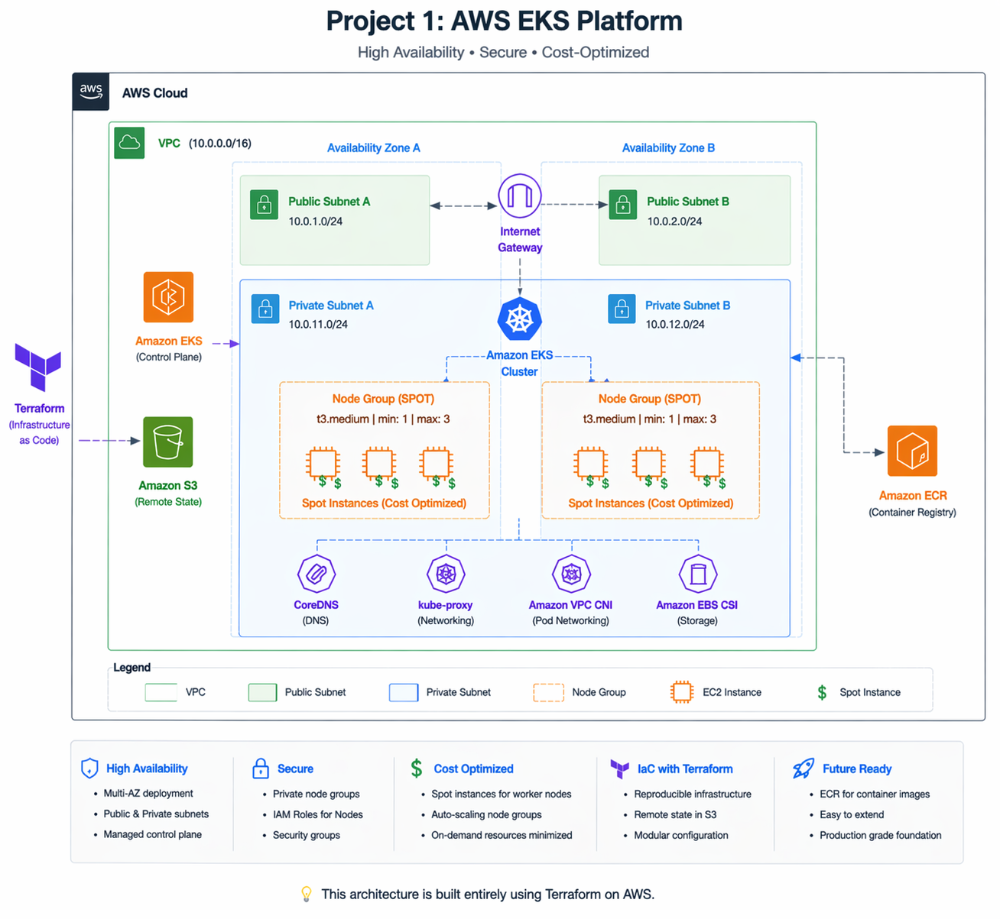

# 🚀 Project 1: Production-Style AWS EKS Platform with Terraform

---

# 📌 Overview

This project is **Phase 1** of my larger **TaskFlow Microservices DevOps Capstone**, where I am building a full production-ready cloud platform in 3 stages:

- ✅ **Project 1:** Infrastructure Provisioning with Terraform  
- ⏭️ **Project 2:** Docker + CI/CD + Monitoring  
- ⏭️ **Project 3:** GitOps + ArgoCD + Advanced Kubernetes Operations  

In this phase, I built a **secure, scalable and cost-aware AWS Kubernetes foundation** using Terraform.

---

# 🏗️ Architecture Diagram

---

# ⚙️ Tech Stack

| Category | Tools |
|--------|------|
| Cloud Provider | AWS |
| Infrastructure as Code | Terraform |
| Container Orchestration | Amazon EKS |
| Networking | VPC, Subnets, Route Tables, NAT Gateway |
| Registry | Amazon ECR |
| State Management | Amazon S3 |
| State Locking | DynamoDB |
| Cost Optimization | Spot Instances |
| Security | IAM Roles |

---

# 🧱 What Was Built

---

## 🌐 1. Custom AWS Networking

Provisioned a dedicated VPC:

10.0.0.0/16
Created:

- 2 Public Subnets
- 2 Private Subnets
- Internet Gateway
- NAT Gateway
- Route Tables
- Route Table Associations

## Why this matters

This follows real production design by separating public traffic from internal workloads.

📸 Networking Resources

## 2. Amazon EKS Cluster

Provisioned a managed Kubernetes control plane:

taskflow-eks-cluster

Worker nodes were deployed into private subnets.

## Why this matters
- Better security posture
- No public exposure of nodes
- Standard enterprise practice
📸 EKS Cluster

## 3. Worker Nodes with Spot Instances

Configured managed node groups using:

capacity_type = "SPOT"
## Why this matters

Spot Instances significantly reduce cost during learning, testing and development workloads.

This helped me optimize spend while building a real project.

📸 Node Group

## 4. IAM Roles & Permissions

Created separate IAM roles for:

- EKS Control Plane
- Worker Nodes

Attached policies:

- AmazonEKSWorkerNodePolicy
- AmazonEKS_CNI_Policy
- AmazonEC2ContainerRegistryReadOnly

## Real Troubleshooting Lesson

My node group initially failed.

Root cause:

Missing AmazonEC2ContainerRegistryReadOnly policy

After attaching it through Terraform, node creation succeeded.

📸 IAM Fix / Successful Node Group

## 5. Amazon ECR Repositories

Prepared container registries for future microservices deployment:

- taskflow-frontend
- taskflow-backend

## Why this matters

This prepares Project 2 for Dockerized deployments.

📸 ECR Repositories

## Terraform Remote State & Locking

To follow production Terraform best practices, I configured:

- Amazon S3 for remote state storage
- DynamoDB for state locking

## Why this matters
- Prevents local state dependency
- Safer collaboration
- Prevents simultaneous state corruption
- Production-ready workflow
📸 S3 Remote State Bucket

📸 DynamoDB Lock Table

## Project Structure
taskflow-eks-platform/
├── project-1-infra/
│   └── terraform/
│       ├── main.tf
│       ├── backend.tf
│       ├── variables.tf
│       ├── terraform.tfvars
│       ├── outputs.tf
│       └── versions.tf
├── project-2-app/
├── project-3-ops/
└── README.md

## Cost Optimization Strategy

## Spot Instances

Used Spot Instances for worker nodes to reduce compute costs.

## Destroy / Recreate Model

Because of unstable power/network conditions, infrastructure was intentionally designed to be:

Destroyable when idle
Recreatable on demand

This reflects practical cost-conscious engineering.

## Challenges Faced
Challenge	Resolution
Node group unhealthy	Added missing ECR read-only IAM policy
Terraform state lock errors	Used DynamoDB locking / force-unlock
Dependency deletion delays	Allowed AWS cleanup and re-ran destroy

## Skills Demonstrated
- AWS Networking
- Kubernetes Foundations
- Terraform IaC
- EKS Provisioning
- IAM Security
- Cost Optimization
- Remote State Management
- Debugging Infrastructure Failures
- Cloud Architecture Thinking

## Next Phase

## Project 2: Application Delivery Layer

Coming next:

- Dockerize frontend/backend
- Push images to ECR
- GitHub Actions CI/CD
- RDS PostgreSQL
- CloudWatch Monitoring
- Prometheus & Grafana
- Helm Charts

## Final Thoughts

This project was not about launching random resources.

It was about building infrastructure that is:

- Secure
- Repeatable
- Cost-aware
- Production-style
- Recruiter-worthy

## Author

Onyedika Okoro

Cloud / DevOps Engineer

Learning in public • Building real projects • Growing daily