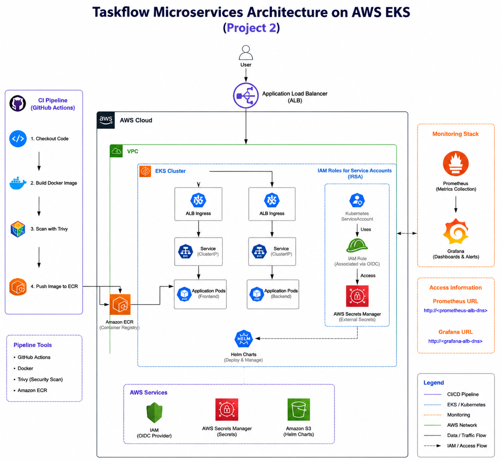
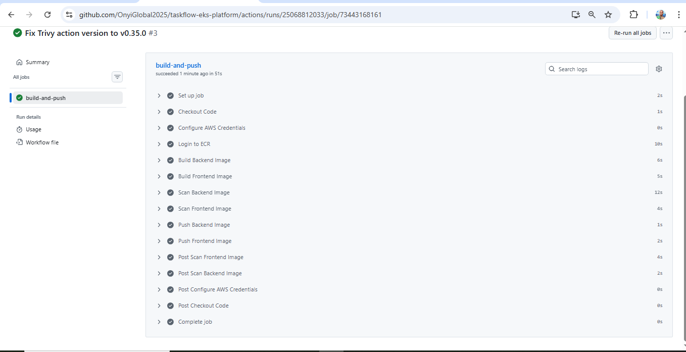
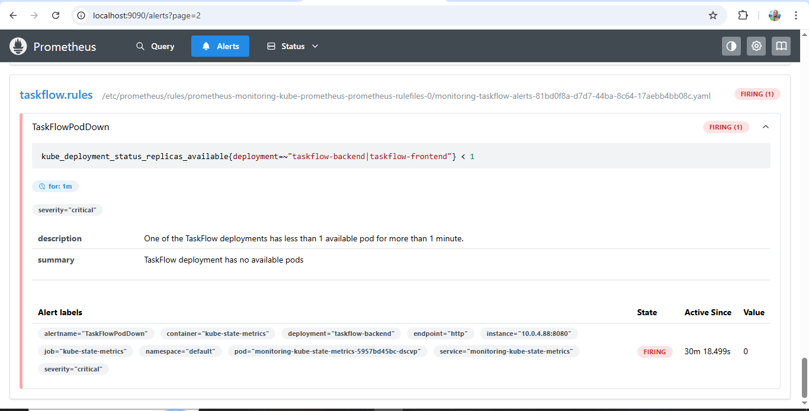
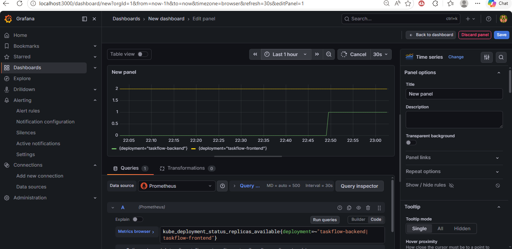

   

This repository contains the TaskFlow application, deployed on Amazon EKS. This second phase of the project includes the CI/CD pipeline, secure secret management, load balancing with AWS ALB, monitoring with Prometheus & Grafana, and security scans with Trivy.

## Table of Contents
- Project Overview
- Technologies Used
- Architecture Diagram
- CI/CD Pipeline
- Service Monitoring
- Security
- Challenges & Lessons Learned
- Next Steps

## Project Overview

The TaskFlow application is a microservices-based platform designed to be deployed on AWS EKS. This project’s main focus was on:

- Setting up CI/CD pipelines using GitHub Actions to automate builds, scans, and deployments.
- Securing sensitive data using AWS Secrets Manager.
- Configuring AWS ALB Ingress with OIDC and IRSA for secure Kubernetes access.
- Service monitoring and alerting with Prometheus and Grafana to ensure uptime and system health.

## Technology Stack

| Technology              | Description                                                                              |
| ----------------------- | ---------------------------------------------------------------------------------------- |
| **AWS EKS**             | Managed Kubernetes service for application deployment.                                   |
| **Docker & ECR**        | Containerized the application and pushed images to **Elastic Container Registry** (ECR). |
| **Helm**                | Managed Kubernetes resources with **Helm** charts.                                       |
| **AWS Secrets Manager** | Secured sensitive credentials and data.                                                  |
| **ALB Ingress**         | Configured **AWS ALB Ingress** to manage application traffic.                            |
| **OIDC & IRSA**         | Used **OIDC** and **IRSA** for secure Kubernetes access with AWS IAM.                    |
| **Prometheus**          | Monitored Kubernetes metrics such as pod availability.                                   |
| **Grafana**             | Visualized system metrics and created dashboards for real-time monitoring.               |
| **Trivy**               | Integrated **Trivy** in **CI** for security scanning and vulnerability management.       |

## Architecture Diagram

This diagram represents the high-level architecture of the project. It includes the CI/CD pipeline, application deployment on AWS EKS, integration with AWS services (IAM, Secrets Manager, etc.), and monitoring using Prometheus and Grafana.

## Architecture Diagram

## CI/CD Pipeline

CI Pipeline:
- GitHub Actions automatically builds Docker images and pushes them to ECR.
- Trivy security scans are integrated into the pipeline to ensure that only clean images are pushed to production.

## Continuous Integration

## Helm Deployment
Helm is used to deploy Kubernetes resources such as services, deployments, and ingress to the EKS cluster

## Service Monitoring

Service monitoring was set up using Prometheus and Grafana:

- Prometheus collects metrics such as pod availability and health status.
- Grafana dashboards were created to visualize these metrics in real-time.

## Prometheus Alerts

## Grafana Dashboard

## Security

Security was a core focus of this project:

- AWS Secrets Manager was used to handle sensitive data like API keys and credentials.
- IAM permissions were fixed to ensure secure access between EKS and ALB Ingress.
- Trivy was used for continuous security scanning of Docker images to ensure that only clean and secure images are pushed to the production environment.

## Challenges & Lessons Learned

## Challenges:

- IAM Permission Issues: I encountered issues with missing EC2 and ELB permissions, which I fixed by adding the necessary IAM roles like ec2:DescribeRouteTables and elasticloadbalancing:AddTags.
- Configuring AWS Load Balancer Controller: The process of configuring the AWS Load Balancer Controller was complex and required troubleshooting missing permissions for EC2 and ELB actions.
- Scaling and Deployment: Initially faced challenges with scaling deployments and ensuring that the Kubernetes pods were properly replicated.

## Lessons Learned:
- Importance of IAM Role Mapping: Setting up IRSA and managing IAM permissions correctly is crucial for accessing AWS resources securely.
- Helm for Resource Management: Using Helm for Kubernetes resources simplified the process of deploying and managing infrastructure in Kubernetes.
- CI/CD and Security Integration: Integrating Trivy in the CI pipeline was a valuable learning experience. It reinforced the need to prioritize security at every step of the deployment process.

## Next Steps

For Project 3, I will focus on extending the pipeline to include CD (Pull & Deploy), where I'll utilize ArgoCD for GitOps deployment. I'll also continue to enhance security, monitoring, and automation across the stack.

## Key Achievements:
- Automated Docker image scanning with Trivy.
- Integrated Prometheus and Grafana for monitoring and observability.
- Managed AWS services (ECR, IAM, ALB) securely and efficiently.

## Author

Okoro Onyedika

Cloud/DevOps Engineer

