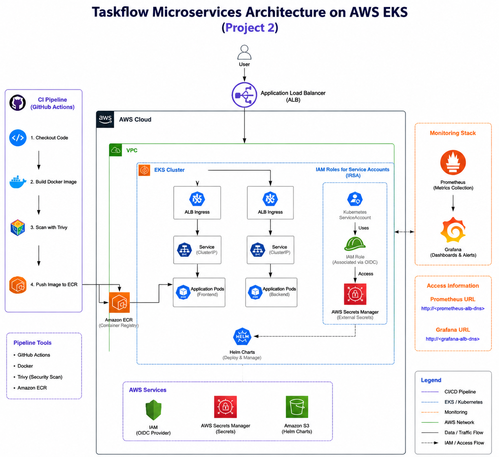
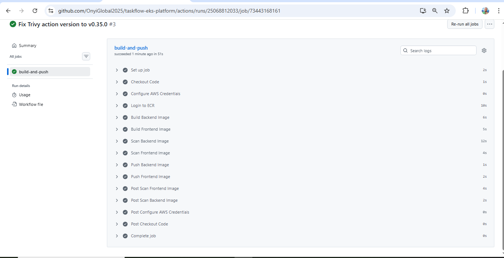
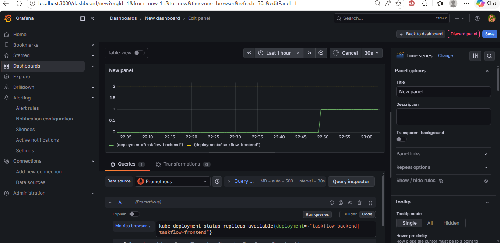

[](https://www.docker.com/)

[](https://kubernetes.io/)
[](https://github.com/)
[](https://aws.amazon.com/elasticloadbalancing/)


---

This repository contains the TaskFlow application deployed on Amazon EKS. This second phase of the project includes the CI/CD pipeline, secure secret management, load balancing with AWS ALB, monitoring with Prometheus and Grafana, and security scans with Trivy.

## Table of Contents
- Project Overview
- Technologies Used
- Architecture Diagram
- CI/CD Pipeline
- AWS ALB Ingress Controller
- Service Monitoring
- Security
- Image Tagging Strategy
- Challenges and Lessons Learned
- Next Steps

---

## Project Overview

The TaskFlow application is a microservices-based platform designed to be deployed on AWS EKS. This project's main focus was on:

- Setting up CI/CD pipelines using GitHub Actions to automate builds, scans, and deployments.
- Storing AWS credentials securely in GitHub secrets for pipeline authentication.
- Configuring AWS ALB Ingress with IRSA for secure Kubernetes access.
- Service monitoring and observability with Prometheus and Grafana.
- Container security scanning with Trivy on every build.

---

## Technology Stack

| Technology | Description |
|---|---|
| **AWS EKS** | Managed Kubernetes service for application deployment |
| **Docker & ECR** | Containerized the application and pushed images to Elastic Container Registry |
| **Helm** | Managed Kubernetes resources with Helm charts |
| **GitHub Actions** | Automated CI/CD pipeline for builds, scans, and deployments |
| **AWS Credentials** | Stored securely in GitHub secrets — never hardcoded in the workflow file |
| **IRSA** | IAM Roles for Service Accounts — linked IAM roles to Kubernetes service accounts |
| **ALB Ingress** | Configured AWS ALB Ingress to manage application traffic with path-based routing |
| **Kubernetes Secrets** | Stored sensitive credentials securely — never hardcoded in code or images |
| **Prometheus** | Monitored Kubernetes metrics such as pod availability and resource usage |
| **Grafana** | Visualized system metrics and created dashboards for real-time monitoring |
| **Trivy** | Integrated security scanning in CI to prevent vulnerable images reaching production |

---

## Architecture Diagram



---

## CI/CD Pipeline

### Overview

The GitHub Actions pipeline triggers automatically on every push to the `main` branch when files inside `project-2-app/` change:

```yaml
on:
  push:
    branches:
      - main
    paths:
      - "project-2-app/**"
```

> **Note:** The pipeline only triggers on application code changes inside `project-2-app/`. Changes to infrastructure manifests, READMEs, or other folders do not trigger the pipeline. This is intentional — infrastructure is managed separately via Terraform and GitOps manifests are managed via ArgoCD.

### Pipeline Steps

1. Checkout code
2. Authenticate to AWS via stored credentials
3. Login to ECR
4. Build backend Docker image
5. Build frontend Docker image
6. Scan backend image with Trivy
7. Scan frontend image with Trivy
8. Push backend image to ECR
9. Push frontend image to ECR

### AWS Credentials Authentication

The pipeline authenticates to AWS using `AWS_ACCESS_KEY_ID` and `AWS_SECRET_ACCESS_KEY` stored as GitHub secrets — never hardcoded in the workflow file:

```yaml
- name: Configure AWS Credentials
  uses: aws-actions/configure-aws-credentials@v4
  with:
    aws-access-key-id: ${{ secrets.AWS_ACCESS_KEY_ID }}
    aws-secret-access-key: ${{ secrets.AWS_SECRET_ACCESS_KEY }}
    aws-region: us-east-1
```

**Why store credentials in GitHub secrets and not in the workflow file?** The workflow file lives in your Git repo which is public. Hardcoding credentials there would expose them to anyone. GitHub secrets are encrypted and only injected into the pipeline at runtime — never visible in logs or code.

> **Security note:** Stored AWS credentials are long-lived. In Phase 3 these were replaced entirely with OIDC authentication — short-lived tokens that expire automatically after each job run with zero stored credentials anywhere.

### Continuous Integration Screenshot


---

## Image Tagging Strategy

### What was done during development

During development Docker images were built and pushed manually with incrementing version tags:

```bash
# Example of manual build and push
docker build -t taskflow-frontend:v1 ./frontend
docker tag taskflow-frontend:v1 713923090919.dkr.ecr.us-east-1.amazonaws.com/taskflow-frontend:v1
docker push 713923090919.dkr.ecr.us-east-1.amazonaws.com/taskflow-frontend:v1
```

Image tags were incremented manually (v1, v2, v3) and deployment manifests were updated accordingly after each build.

### The production-ready approach

In a production environment the correct approach is to use `github.sha` as the image tag — ensuring every build is unique, immutable, and traceable back to the exact commit that built it:

```yaml
env:
  IMAGE_TAG: ${{ github.sha }}

- name: Build Frontend Image
  run: |
    docker build -t taskflow-frontend:${{ env.IMAGE_TAG }} ./frontend
    docker push 713923090919.dkr.ecr.us-east-1.amazonaws.com/taskflow-frontend:${{ env.IMAGE_TAG }}

- name: Update deployment manifest
  run: |
    sed -i "s|taskflow-frontend:.*|taskflow-frontend:${{ env.IMAGE_TAG }}|g" \
      helm/taskflow/templates/frontend-deployment.yaml

- name: Commit updated image tag
  run: |
    git config user.email "actions@github.com"
    git config user.name "GitHub Actions"
    git add helm/taskflow/templates/frontend-deployment.yaml
    git commit -m "ci: update image tag to ${{ env.IMAGE_TAG }}"
    git push
```

This eliminates all manual steps — the pipeline builds, tags, pushes, updates the manifest, and commits back to Git. ArgoCD then detects the new commit and deploys automatically.

---

## AWS ALB Ingress Controller

The AWS Application Load Balancer Ingress Controller manages Kubernetes Ingress resources in EKS. It provisions an ALB in AWS and configures routing based on Ingress resources.

### Key features

- **Path-based routing** — routes traffic to different services based on URL path
- **TLS termination** — handles SSL/TLS and forwards traffic securely to backend
- **IAM integration** — uses IRSA for secure access to AWS ALB resources
- **Acts as reverse proxy and load balancer** — users never see internal pod IPs

### How path-based routing works

The ALB reads the URL path the user typed and matches it against your ingress rules:

```yaml
rules:
  - host: app.okorojeremiah.online
    http:
      paths:
        - path: /         → frontend service (port 80)
        - path: /api      → backend service (port 5000)
        - path: /metrics  → backend service (port 5000)
```

When a user types `app.okorojeremiah.online/api/tasks` the ALB reads `/api/tasks`, matches it to `/api` and routes to the backend service.

### Installation

```bash
# Add Helm repository
helm repo add eks-charts https://aws.github.io/eks-charts
helm repo update

# Install ALB Ingress Controller
helm upgrade --install aws-load-balancer-controller \
  eks/aws-load-balancer-controller \
  -n kube-system \
  --set clusterName=taskflow-eks-cluster \
  --set serviceAccount.create=false \
  --set serviceAccount.name=aws-load-balancer-controller \
  --set region=us-east-1 \
  --set vpcId=$(aws eks describe-cluster \
    --name taskflow-eks-cluster \
    --region us-east-1 \
    --query "cluster.resourcesVpcConfig.vpcId" \
    --output text)
```

### Deploy application via Helm

```bash
helm upgrade --install taskflow ./project-2-app/helm/taskflow
```

---

## Service Monitoring

Prometheus and Grafana were installed using the `kube-prometheus-stack` Helm chart which provides pre-built Kubernetes dashboards out of the box.

```bash
# Create monitoring namespace
kubectl create namespace monitoring

# Install kube-prometheus-stack
helm install monitoring prometheus-community/kube-prometheus-stack \
  -n monitoring
```

- **Prometheus** collects metrics from all pods, nodes, and the Kubernetes API
- **Grafana** visualizes those metrics in real-time dashboards

### Dashboards configured
- Kubernetes / Compute Resources / Cluster — overall cluster health
- Kubernetes / Compute Resources / Namespace (Pods) — per pod metrics
- Kubernetes / Nodes — node level CPU and memory

### Retrieve Grafana credentials

**Username:** `admin`

**Password:** Retrieve from the auto-generated secret:

```bash
kubectl get secret monitoring-grafana \
  -n monitoring \
  -o jsonpath="{.data.admin-password}" | base64 -d && echo
```

### Grafana Dashboard


---

## Security

Security was a core focus of this project:

- **AWS credentials** stored in GitHub secrets — never hardcoded in the workflow file
- **IRSA** linked IAM roles to Kubernetes service accounts — pods get scoped temporary credentials automatically
- **Kubernetes Secrets** stored all sensitive credentials — never hardcoded in code or Docker images
- **Trivy** scanned every Docker image before pushing to ECR — vulnerable images never reach production
- **IAM least privilege** — each role has only the permissions it needs

---

## Challenges and Lessons Learned

| Challenge | Root Cause | Resolution |
|---|---|---|
| IAM permission issues | Missing `ec2:DescribeRouteTables` and `elasticloadbalancing:AddTags` permissions | Added missing permissions to the ALB controller IAM policy |
| ALB not provisioning | ALB Ingress Controller misconfigured | Verified IRSA setup and corrected service account annotation |
| Pods not scaling properly | Missing resource requests on deployments | Added CPU and memory requests to all deployment manifests |
| ECR push failing | AWS credentials not configured correctly in GitHub secrets | Verified `AWS_ACCESS_KEY_ID` and `AWS_SECRET_ACCESS_KEY` were correctly set |

### Lessons Learned

- **IRSA is essential** — managing IAM permissions correctly is the foundation of secure EKS deployments
- **Helm simplifies everything** — packaging manifests into a chart with a single values.yaml makes deployments reproducible and rollbacks instant
- **Never hardcode credentials** — always store them in GitHub secrets, never in the workflow file
- **Static image tags are an antipattern** — `v1` works for learning but production requires unique immutable tags per commit using `github.sha`

---

## Key Achievements

- Stored AWS credentials securely — never exposed in code or logs
- Automated Docker image scanning with Trivy on every build
- Configured path-based routing with ALB — frontend and backend on one domain
- Integrated Prometheus and Grafana with pre-built Kubernetes dashboards
- Managed all AWS services securely using IRSA and Kubernetes secrets

---

## Next Steps

Project 3 extends this platform with:
- GitOps with ArgoCD — automatic cluster sync on every Git push
- AWS Cognito — managed user authentication
- OIDC — replacing stored AWS credentials with short-lived tokens
- HPA — automatic pod autoscaling based on CPU and memory
- ExternalDNS — automatic Route 53 DNS management
- ACM — wildcard TLS certificate for HTTPS
- RDS PostgreSQL — persistent database storage

---

## Author

Okoro Onyedika

Cloud / Platform Engineer

Learning in public • Building real projects • Growing daily