markdown# Project 3: GitOps, Security & Advanced Kubernetes Operations


---

## Overview

This is **Phase 3** of the **TaskFlow Microservices DevOps Capstone** — the most advanced phase of the project. Building on the infrastructure provisioned in Project 1 and the CI/CD pipeline from Project 2, this phase focuses on production-grade operations:

- ✅ **Project 1:** Infrastructure Provisioning with Terraform
- ✅ **Project 2:** Docker + CI/CD + Helm + ALB + Monitoring
- ✅ **Project 3:** GitOps + Auth + Autoscaling + DNS + TLS + RDS + Observability

The goal was to transform the Taskflow app from a manually deployed application into a **fully automated, self-healing, securely accessible production system**.

---

## Live Application

**🌐 https://app.okorojeremiah.online**

- Secured with HTTPS via AWS ACM wildcard certificate
- DNS managed automatically by ExternalDNS + Route 53
- Data persisted in RDS PostgreSQL

---

## Architecture Diagram

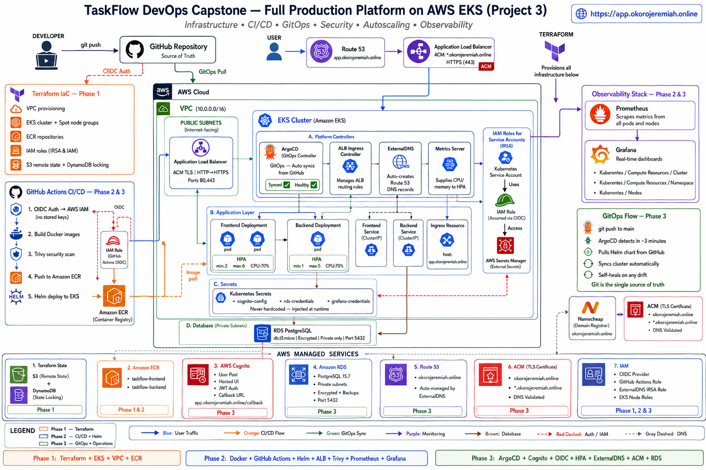

---

## Tech Stack

| Category | Tools |
|---|---|
| GitOps / CD | ArgoCD |
| Authentication | AWS Cognito |
| Pipeline Auth | OIDC (GitHub Actions → AWS) |
| Autoscaling | Kubernetes HPA + Metrics Server |
| DNS Management | ExternalDNS + Route 53 |
| TLS / HTTPS | AWS Certificate Manager (ACM) |
| Database | RDS PostgreSQL (db.t3.micro) |
| Monitoring | Prometheus + Grafana |
| Secret Management | Kubernetes Secrets |
| Package Management | Helm |
| Domain Registrar | Namecheap → delegated to Route 53 |

---

## What Was Built

---

### 1. ArgoCD for GitOps CD

Installed ArgoCD via Helm into a dedicated `argocd` namespace. Connected it to the GitHub repository and created an `Application` manifest that watches the `project-2-app/helm/taskflow` path.

**Why this matters:**
Before ArgoCD, deployments required manual `helm upgrade` commands. Now, every `git push` to main automatically syncs the cluster — no manual intervention. If someone manually changes cluster state, ArgoCD detects the drift and self-heals.

**Key configuration:**
- `syncPolicy.automated.selfHeal: true` — auto-reverts manual changes
- `syncPolicy.automated.prune: true` — removes deleted resources automatically

## ArgoCD Resource Tree
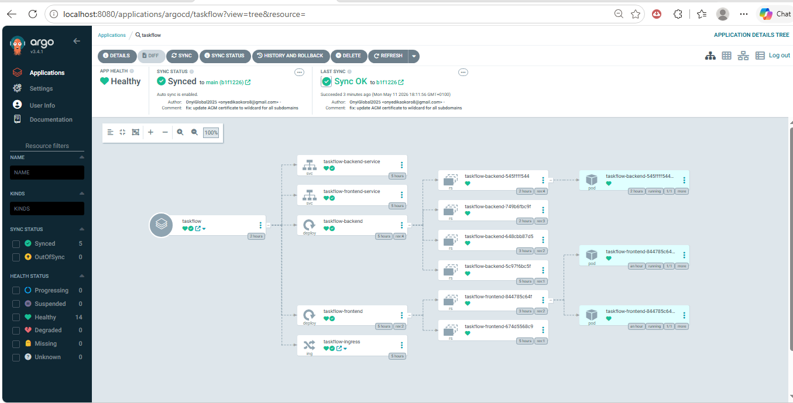

## ArgoCD Applications
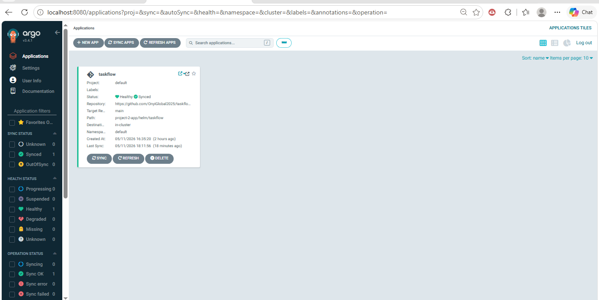

---

### 2. AWS Cognito Authentication

Provisioned an AWS Cognito User Pool with a hosted UI for user authentication. Created an app client with OAuth 2.0 authorization code grant flow.

**Why this matters:**
Building authentication from scratch is complex and insecure. Cognito handles user registration, login, email verification, password resets, and JWT token generation — all managed by AWS. The backend verifies JWT tokens using Cognito's public JWKS endpoint.

**What was configured:**
- User Pool with email sign-in
- Self-registration enabled
- Hosted UI with callback URL
- Cognito credentials stored as Kubernetes secrets (never hardcoded)
- Backend middleware to verify JWT tokens via `jwks-rsa`

## Cognito User Pool
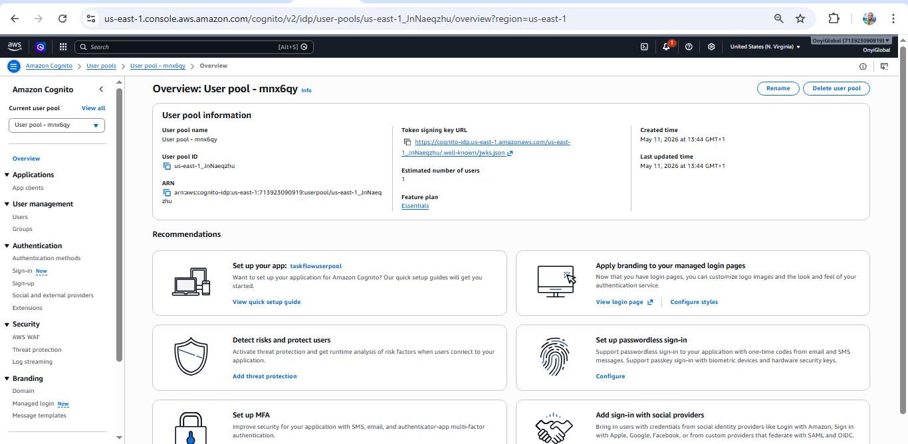

## Cognito Hosted UI
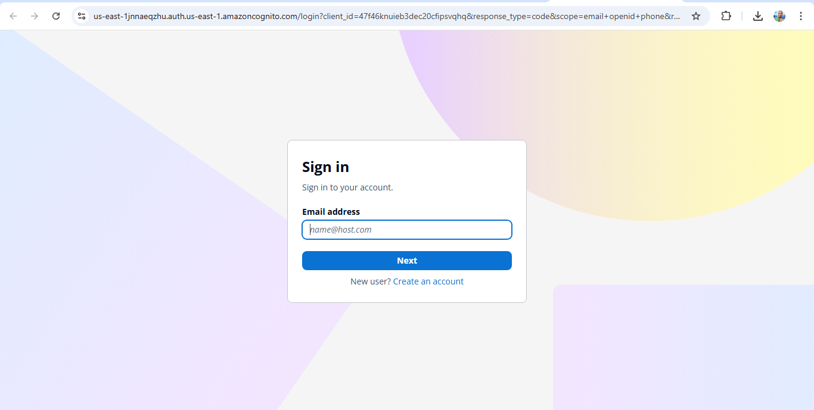

---

### 3. OIDC Authentication for CI/CD Pipeline

Replaced long-lived AWS access keys in GitHub Actions with OIDC (OpenID Connect) authentication. The pipeline now assumes an IAM role using a short-lived token issued by GitHub per workflow run.

**Why this matters:**
Stored AWS credentials in GitHub secrets are a security risk — if leaked, they provide permanent access. OIDC tokens are temporary, scoped to a specific repo and branch, and expire automatically after each job. This is the industry standard for secure CI/CD authentication.

**What was configured:**
- OIDC Identity Provider added to AWS IAM
- IAM role `taskflow-github-actions-role` scoped to `OnyiGlobal2025/taskflow-eks-platform` main branch
- GitHub Actions workflow updated with `id-token: write` permission
- Old `AWS_ACCESS_KEY_ID` and `AWS_SECRET_ACCESS_KEY` secrets deleted

> **Note:** The GitHub Actions pipeline triggers only on changes to `project-2-app/**`.
> Infrastructure manifests and GitOps configurations are managed separately —
> ArgoCD watches the Git repository and syncs cluster state automatically.
> This is intentional: application builds and infrastructure management are
> separate concerns in a production GitOps workflow.

## OIDC Pipeline Success
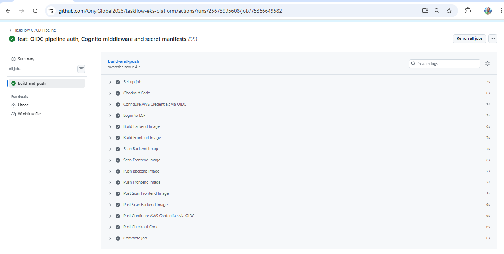

---

### 4. Horizontal Pod Autoscaler (HPA)

Installed Metrics Server and configured HPA for both frontend and backend deployments.

**Why this matters:**
A fixed number of pods cannot handle variable traffic. HPA monitors real CPU and memory usage and automatically scales pods up when load increases and scales back down when traffic drops — saving cost during quiet periods.

**Configuration:**

| Deployment | Min Pods | Max Pods | CPU Threshold | Memory Threshold |
|---|---|---|---|---|
| taskflow-backend | 1 | 5 | 70% | 80% |
| taskflow-frontend | 2 | 6 | 70% | 80% |

## HPA Metrics
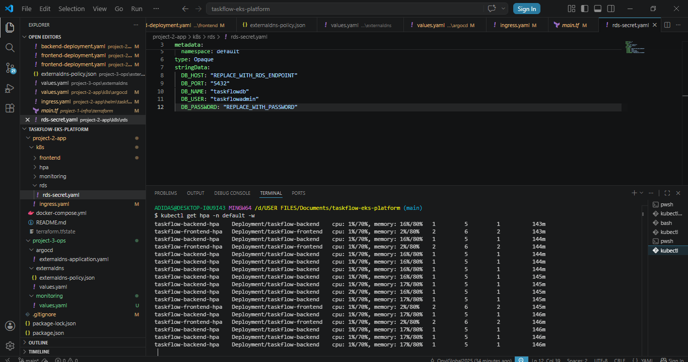

---

### 5. ExternalDNS for Dynamic DNS Management

Installed ExternalDNS via Helm with an IRSA-scoped IAM role. Configured it to watch ingress resources and automatically create Route 53 DNS records.

**Why this matters:**
Without ExternalDNS, every time the ALB DNS name changes you'd manually update DNS records. ExternalDNS reads the `external-dns.alpha.kubernetes.io/hostname` annotation from your ingress and creates/updates Route 53 records automatically — zero manual DNS management.

**Real proof:**
After deploying the updated ingress with `app.okorojeremiah.online`, ExternalDNS logs showed:
Desired change: CREATE app.okorojeremiah.online A
4 record(s) were successfully updated

## ExternalDNS Logs
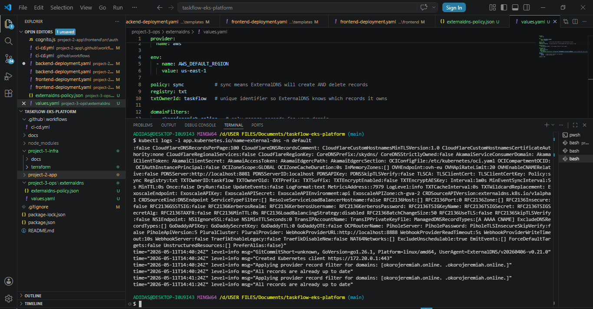

---

### 6. ACM for TLS Certification

Requested a wildcard ACM certificate covering `okorojeremiah.online` and `*.okorojeremiah.online`. Validated via Route 53 DNS validation and attached to the ALB ingress.

**Why this matters:**
HTTPS encrypts all traffic between users and the ALB. A wildcard certificate covers all subdomains — `app.`, `api.`, `argocd.` — with a single certificate that auto-renews for free.

**Key ingress annotations added:**
```yaml
alb.ingress.kubernetes.io/certificate-arn: "arn:aws:acm:..."
alb.ingress.kubernetes.io/listen-ports: '[{"HTTP":80,"HTTPS":443}]'
alb.ingress.kubernetes.io/ssl-redirect: "443"
```

## ACM Certificate Issued
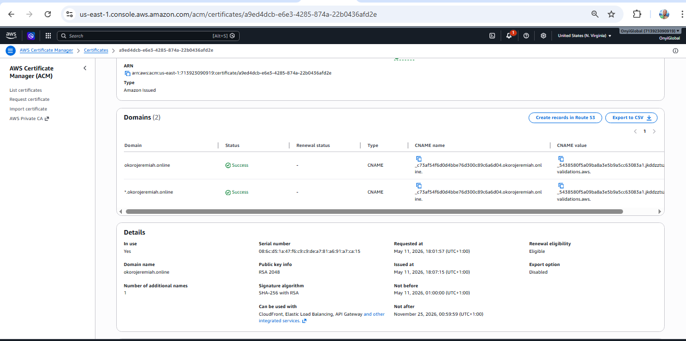

## App Running on HTTPS
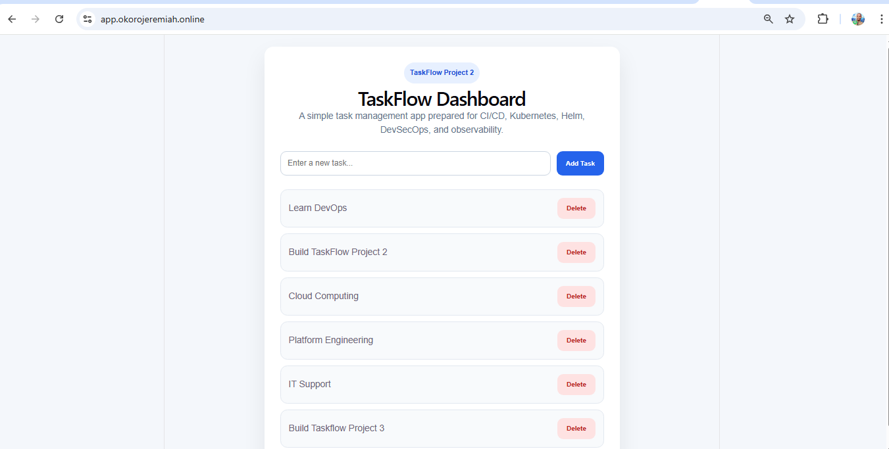

---

### 7. RDS for Persistent Database Storage

Provisioned an RDS PostgreSQL instance in private subnets with a dedicated security group allowing only VPC traffic on port 5432.

**Why this matters:**
Pod storage is ephemeral — data is lost when pods restart. RDS provides managed, persistent storage with automatic backups, encryption at rest, and high availability. This is standard for any production application.

**Configuration:**
- Engine: PostgreSQL 15.7
- Instance: db.t3.micro
- Storage: 20GB encrypted (gp2)
- Subnet group: private subnets only
- Security group: port 5432 open to VPC CIDR only
- Credentials injected via Kubernetes secrets (never hardcoded)
- Backup retention: 7 days

**Real proof:**
Tasks added to the app persisted after closing and reopening the browser — confirming the backend is reading and writing to RDS correctly.

## RDS Instance
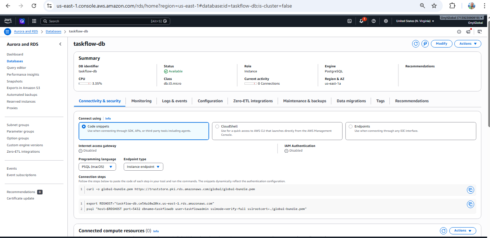

---

### 8. GitOps Integration with ArgoCD

Created ArgoCD `Application` manifests for the taskflow Helm chart. Tested the full GitOps loop by pushing a change to Git and watching ArgoCD automatically sync the cluster within 3 minutes.

**Why this matters:**
This closes the full DevOps loop — code change → Git push → ArgoCD detects → cluster updated automatically. No manual deployment steps. Full audit trail in Git.

**GitOps loop proven:**
1. Updated ingress `host` rule in Git
2. Pushed to main
3. ArgoCD detected the change
4. Cluster synced automatically — no `helm upgrade` needed

---

### 9. Monitoring and Observability

Installed `kube-prometheus-stack` via Helm providing Prometheus and Grafana with pre-built Kubernetes dashboards.

**Why this matters:**
Without monitoring you're flying blind. Prometheus scrapes metrics from every pod, node, and the Kubernetes API. Grafana visualizes them in real time — you can see exactly which pods are consuming CPU, which nodes are under pressure, and set alerts before things break.

**Dashboards configured:**
- Kubernetes / Compute Resources / Cluster — overall cluster health
- Kubernetes / Compute Resources / Namespace (Pods) — per-pod metrics
- Kubernetes / Nodes — node-level CPU and memory

**Credentials secured:**
Grafana admin password stored in a Kubernetes secret — never hardcoded in values.yaml.

## Grafana Cluster Dashboard
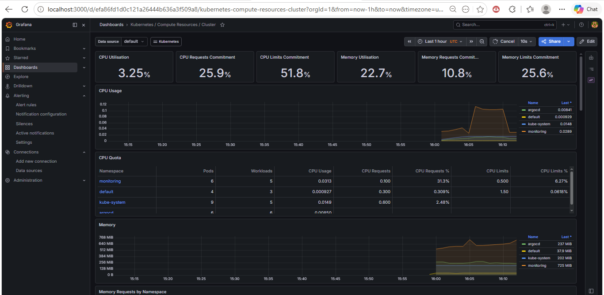

## Grafana Pod Dashboard
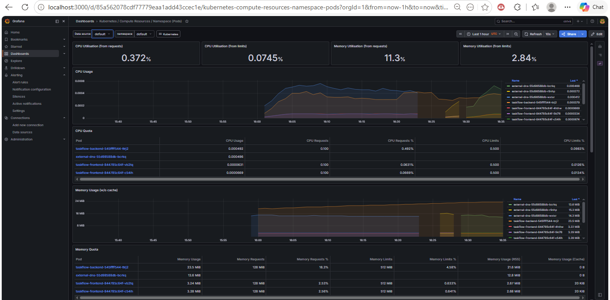

---

## Project Structure

```text
taskflow-eks-platform/
├── project-1-infra/           # Terraform EKS infrastructure
├── project-2-app/             # Application Helm charts and CI/CD
│   ├── .github/workflows/     # GitHub Actions pipeline
│   ├── helm/taskflow/         # Helm chart (frontend, backend, ingress)
│   └── k8s/                   # Raw Kubernetes manifests
│       ├── argocd/            # ArgoCD Application manifests
│       ├── backend/           # Backend deployment + service
│       ├── cognito/           # Cognito secret manifest
│       ├── frontend/          # Frontend deployment + service
│       ├── hpa/               # HPA manifests
│       └── rds/               # RDS secret manifest
└── project-3-ops/             # Project 3 operations configs
    ├── argocd/                # ArgoCD application manifests
    ├── externaldns/           # ExternalDNS Helm values + IAM policy
    ├── iam/                   # GitHub Actions OIDC IAM role (Terraform)
    └── monitoring/            # Prometheus + Grafana Helm values
```

---

## Security Practices Applied

| Practice | Implementation |
|---|---|
| No stored AWS credentials | OIDC replaces access keys in CI/CD |
| Secrets never hardcoded | All credentials in Kubernetes secrets |
| Database not publicly accessible | RDS in private subnets, VPC-only access |
| HTTPS enforced | HTTP → HTTPS redirect via ALB annotation |
| Wildcard TLS certificate | ACM covers all subdomains |
| IAM least privilege | IRSA roles scoped per service |
| Container scanning | Trivy in CI pipeline (from Project 2) |

---

## Challenges & Lessons Learned

| Challenge | Root Cause | Resolution |
|---|---|---|
| ArgoCD conflicting with `helm upgrade` | ArgoCD owns resources — Helm can't modify them directly | Pushed changes to Git and let ArgoCD sync automatically |
| ExternalDNS sync status Unknown in ArgoCD | Git path only had values.yaml, not a full Helm chart | Removed ExternalDNS from ArgoCD management — it runs independently via Helm |
| HPA showing `<unknown>` metrics | Pods had no resource requests defined | Added CPU/memory requests to deployment manifests via `kubectl patch` |
| ACM certificate showing "Not secure" | Original certificate didn't include wildcard `*.okorojeremiah.online` | Requested new certificate with both root and wildcard domains |
| Load test pod failing on Windows | Git Bash on Windows can't exec Linux containers | Used manual `kubectl scale` to demonstrate scaling behavior |
| RDS password rejected | `@` symbol not allowed in RDS passwords | Used alphanumeric password without special characters |
| Helm upgrade conflict with ArgoCD | ArgoCD controller owns the resources | Understood that GitOps means Git is the only update mechanism |

---

## Skills Demonstrated

- GitOps with ArgoCD
- AWS Cognito user authentication
- OIDC-based CI/CD security
- Kubernetes autoscaling (HPA)
- Dynamic DNS management
- TLS/HTTPS certificate management
- Managed database provisioning (RDS)
- Kubernetes secret management
- Helm chart management
- Prometheus and Grafana observability
- IRSA (IAM Roles for Service Accounts)
- Production security practices

---

## Key Achievements

- 🌐 Live app accessible at `https://app.okorojeremiah.online`
- 🔒 Fully secured with HTTPS and ACM wildcard certificate
- 🗄️ Data persists across pod restarts via RDS PostgreSQL
- 🔄 Full GitOps loop — Git push triggers automatic cluster sync
- 📊 Real-time cluster observability via Grafana dashboards
- 🔐 Zero stored AWS credentials — OIDC throughout
- ⚖️ Auto-scaling configured and proven working


---

## Key Commands Reference

### ArgoCD
```bash
# Install ArgoCD via Helm
helm install argocd argo/argo-cd \
  --namespace argocd \
  --values project-2-app/k8s/argocd/values.yaml

# Port-forward ArgoCD UI
kubectl port-forward svc/argocd-server -n argocd 8080:443

# Get ArgoCD admin password
kubectl get secret argocd-initial-admin-secret \
  -n argocd \
  -o jsonpath="{.data.password}" | base64 -d

# Apply ArgoCD Application manifest
kubectl apply -f project-2-app/k8s/argocd/taskflow-application.yaml

# Check application sync status
kubectl get applications -n argocd
```

### Cognito
```bash
# Create Cognito Kubernetes secret
kubectl create secret generic cognito-config \
  --namespace=default \
  --from-literal=COGNITO_USER_POOL_ID=us-east-1_JnNaeqzhu \
  --from-literal=COGNITO_CLIENT_ID=47f46knuieb3dec20cfipsvqhq \
  --from-literal=COGNITO_REGION=us-east-1 \
  --from-literal=COGNITO_DOMAIN=us-east-1jnnaeqzhu.auth.us-east-1.amazoncognito.com

# Verify secret
kubectl get secret cognito-config -n default
```

### HPA & Metrics Server
```bash
# Install Metrics Server
kubectl apply -f https://github.com/kubernetes-sigs/metrics-server/releases/latest/download/components.yaml

# Verify Metrics Server
kubectl get deployment metrics-server -n kube-system

# Check node metrics
kubectl top nodes

# Apply HPA manifests
kubectl apply -f project-2-app/k8s/hpa/backend-hpa.yaml
kubectl apply -f project-2-app/k8s/hpa/frontend-hpa.yaml

# Watch HPA in real time
kubectl get hpa -n default -w

# Add resource requests via patch
kubectl patch deployment taskflow-backend -n default --patch '{
  "spec": {
    "template": {
      "spec": {
        "containers": [{
          "name": "taskflow-backend",
          "resources": {
            "requests": {"cpu": "100m", "memory": "128Mi"},
            "limits": {"cpu": "500m", "memory": "512Mi"}
          }
        }]
      }
    }
  }
}'
```

### ExternalDNS
```bash
# Create IAM policy
aws iam create-policy \
  --policy-name ExternalDNSPolicy \
  --policy-document file://project-3-ops/externaldns/externaldns-policy.json

# Create IRSA role
aws iam create-role \
  --role-name ExternalDNSRole \
  --assume-role-policy-document '{...}'

# Attach policy to role
aws iam attach-role-policy \
  --role-name ExternalDNSRole \
  --policy-arn arn:aws:iam::713923090919:policy/ExternalDNSPolicy

# Install ExternalDNS via Helm
helm install external-dns external-dns/external-dns \
  --namespace default \
  --values values.yaml

# Check ExternalDNS logs
kubectl logs -l app.kubernetes.io/name=external-dns -n default --tail=20
```

### ACM & Route 53
```bash
# Request ACM certificate via CLI
aws acm request-certificate \
  --domain-name "okorojeremiah.online" \
  --subject-alternative-names "*.okorojeremiah.online" \
  --validation-method DNS \
  --region us-east-1

# Check certificate status
aws acm describe-certificate \
  --certificate-arn arn:aws:acm:us-east-1:713923090919:certificate/YOUR-CERT-ARN \
  --query "Certificate.SubjectAlternativeNames" \
  --output table

# List hosted zones
aws route53 list-hosted-zones \
  --query "HostedZones[*].{Name:Name,Id:Id}" \
  --output table
```

### RDS
```bash
# Create RDS security group
aws ec2 create-security-group \
  --group-name taskflow-rds-sg \
  --description "Security group for Taskflow RDS PostgreSQL" \
  --vpc-id vpc-0abeed09a66fc59b7

# Allow VPC traffic on port 5432
aws ec2 authorize-security-group-ingress \
  --group-id YOUR-SG-ID \
  --protocol tcp \
  --port 5432 \
  --cidr 10.0.0.0/16

# Create RDS subnet group
aws rds create-db-subnet-group \
  --db-subnet-group-name taskflow-rds-subnet-group \
  --db-subnet-group-description "Subnet group for Taskflow RDS" \
  --subnet-ids subnet-0478c55deced328ac subnet-056318ca9f58f0288

# Create RDS instance
aws rds create-db-instance \
  --db-instance-identifier taskflow-db \
  --db-instance-class db.t3.micro \
  --engine postgres \
  --engine-version 15.7 \
  --master-username taskflowadmin \
  --master-user-password YOUR-PASSWORD \
  --allocated-storage 20 \
  --db-name taskflowdb \
  --vpc-security-group-ids YOUR-SG-ID \
  --db-subnet-group-name taskflow-rds-subnet-group \
  --no-publicly-accessible \
  --backup-retention-period 7 \
  --storage-encrypted \
  --region us-east-1

# Check RDS status
aws rds describe-db-instances \
  --db-instance-identifier taskflow-db \
  --query "DBInstances[0].{Status:DBInstanceStatus,Endpoint:Endpoint.Address}" \
  --output table

# Create RDS Kubernetes secret
kubectl create secret generic rds-credentials \
  --namespace=default \
  --from-literal=DB_HOST=YOUR-RDS-ENDPOINT \
  --from-literal=DB_PORT=5432 \
  --from-literal=DB_NAME=taskflowdb \
  --from-literal=DB_USER=taskflowadmin \
  --from-literal=DB_PASSWORD=YOUR-PASSWORD
```

### Monitoring
```bash
# Add Prometheus community Helm repo
helm repo add prometheus-community \
  https://prometheus-community.github.io/helm-charts
helm repo update

# Create Grafana credentials secret
kubectl create secret generic grafana-credentials \
  --namespace monitoring \
  --from-literal=admin-password=YOUR-PASSWORD \
  --from-literal=admin-user=admin

# Install kube-prometheus-stack
helm install monitoring prometheus-community/kube-prometheus-stack \
  --namespace monitoring \
  --create-namespace \
  --values project-3-ops/monitoring/values.yaml

# Check monitoring pods
kubectl get pods -n monitoring

# Port-forward Grafana UI
kubectl port-forward svc/monitoring-grafana 3000:80 -n monitoring
```

### General Cluster Health
```bash
# Check all pods
kubectl get pods -n default

# Check all pods across all namespaces
kubectl get pods -A

# Check HPA status
kubectl get hpa -n default

# Check ingress
kubectl get ingress -n default

# Check all Helm releases
helm list -n default
helm list -n argocd
helm list -n monitoring
```

### Destroy Order
```bash
# 1. Uninstall Helm releases
helm uninstall taskflow -n default
helm uninstall argocd -n argocd
helm uninstall external-dns -n default
helm uninstall monitoring -n monitoring

# 2. Delete Kubernetes secrets
kubectl delete secret cognito-config -n default
kubectl delete secret rds-credentials -n default
kubectl delete secret grafana-credentials -n monitoring

# 3. Delete RDS
aws rds delete-db-instance \
  --db-instance-identifier taskflow-db \
  --skip-final-snapshot \
  --region us-east-1

# 4. Delete RDS subnet group (after RDS is fully deleted)
aws rds delete-db-subnet-group \
  --db-subnet-group-name taskflow-rds-subnet-group

# 5. Delete security group
aws ec2 delete-security-group \
  --group-id sg-0480552053c16de56

# 6. Terraform destroy
cd project-1-infra/terraform
terraform destroy -auto-approve
```

---

## Author

Onyedika Okoro

Cloud / DevOps Engineer

Learning in public • Building real projects • Growing daily
